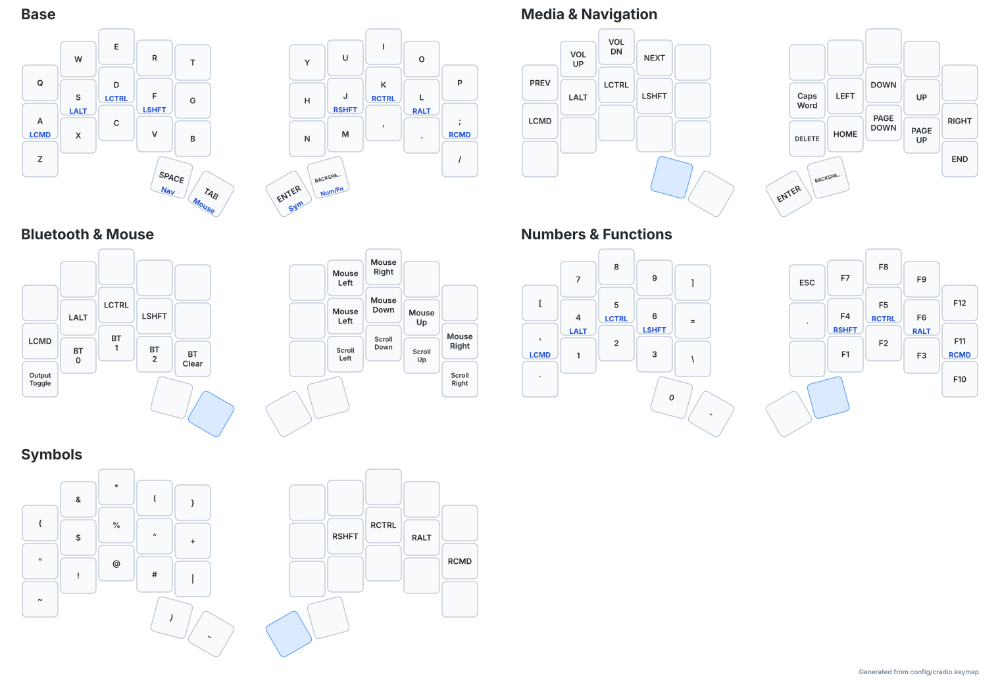

# Ferris Sweep ZMK configuration

Personal ZMK firmware configuration for a Ferris Sweep (Cradio) with two
nice!nano v2 controllers.

## Repository layout

- `config/cradio.keymap` contains the layers and key behaviors.
- `config/cradio.conf` contains firmware feature flags.
- `config/west.yml` pins the ZMK dependency.
- `build.yaml` defines the left, right, and settings-reset firmware targets.
- `.github/workflows/build.yml` builds and packages the firmware with GitHub
  Actions.
- `keymap_drawer.config.yaml` controls labels and styling for the generated
  keymap reference.
- `scripts/render-keymap.sh` regenerates `docs/keymap/cradio.yaml` and the SVG
  reference from `config/cradio.keymap`.
- `boards/` and `zephyr/module.yml` provide the standard ZMK module layout for
  future out-of-tree hardware definitions.

## Firmware targets

| Target | Purpose |
| --- | --- |
| `cradio_left` + `nice_nano_v2` | Central half; connects to the computer |
| `cradio_right` + `nice_nano_v2` | Peripheral half; connects to the central half |
| `settings_reset` + `nice_nano_v2` | Erases stored settings for recovery |

Flash left and right firmware from the same build. The settings-reset image is
only for recovering broken Bluetooth or split pairing and must be followed by
flashing the normal image to each half again.

## Version policy

The ZMK manifest and reusable workflow are pinned to the same stable release.
Upgrade them together, build all three targets, and keep the previous known-good
firmware until the new build has been tested on both halves.

## Keymap reference



The generated reference shows every layer using the physical Ferris Sweep
geometry, including tap/hold labels for home-row modifiers and layer-tap thumb
keys.

Regenerate it after changing the keymap:

```sh
./scripts/render-keymap.sh
```

The script uses `uvx` and pins `keymap-drawer` to version `0.23.0`, so it does
not require a permanent Python package installation.
